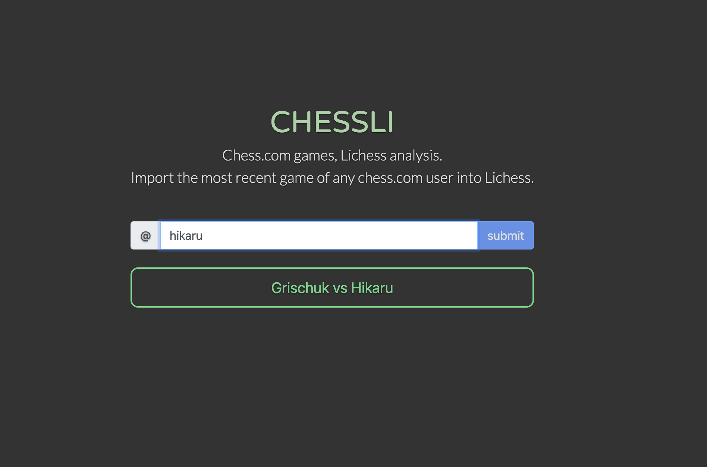

# chessli
Lichess analysis for chess.com games.

What
----
`chessli` allows any player to automatically import their most recent chess.com game into Lichess for analysis.

Where
---
The site is live at [chessli.net](https://chessli.net)

Why
---
I much prefer running analysis on Lichess than chess.com, and built a
script when I became tired of manually copy/pasting every PGN into Lichess for games
that I wanted to analyze. I wanted to gain experience with developing and
deploying a web-app, so I decided to build the script into something more fully
functional for more users.`chessli` now allows any chess.com user to analyze their games
for free on Lichess without hassle (and maybe save some subcription money in the
process?). 

Alternatives like [Chess.com Analysis at
Lichess](https://chrome.google.com/webstore/detail/chesscom-analysis-at-lich/bhjlkimpkkgkmfjlcfngmakenalgleap?hl=en)
require users to be on a desktop using Chrome. In contrast, `chessli` can be run on any
platform, anywhere, at any time. If you're at a tournament, you can play some blitz in
between rounds on your phone and analyze on Lichess :-)

How
---
Flask backend with a simple bootstrap/js frontend and ajax/jquery intermediary. The
backend is served through `chessli.py` as the main flask app, which relies on
`chessli_lib.py` for communcation with the chess.com and Lichess APIs.
Frontend assets are stored in `static`. The app is deployed on Heroku with domain
registry with Google Domains and SSL provided by Cloudfare.

